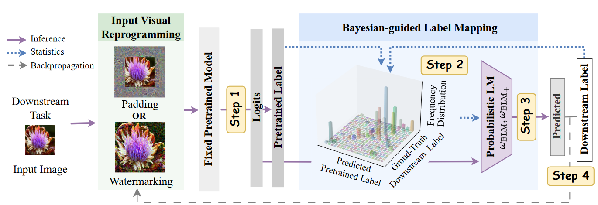

# Bayesian-Guided Label Mapping for Visual Reprogramming
 

This repository is the official PyTorch implementation of the **NeurIPS 2024** paper:
[Bayesian-Guided Label Mapping for Visual Reprogramming](),
authored by Chengyi Cai, Zesheng Ye, Lei Feng, Jianzhong Qi, and Feng Liu.

**Abstract:**
*Visual reprogramming* (VR) leverages the intrinsic capabilities of pretrained vision models by adapting their input or output interfaces to solve downstream tasks whose labels (i.e., downstream labels) might be totally different from the labels associated with the pretrained models (i.e., pretrained labels). 
When adapting the output interface of the pretrained model, label mapping (LM) methods are proposed to map the pretrained labels to downstream labels via a gradient-free one-to-one label mapping function.
However, in this paper, we reveal that one-to-one mappings may overlook the complex relationship between pretrained and downstream labels. Motivated by this observation, we propose a ***B**ayesian-guided **L**abel **M**apping* (BLM) method. 
BLM constructs iteratively-updated probabilistic label mapping matrices, with each element quantifying pairwise relationship between pretrained and downstream labels.
The assignment of values to the constructed matrices is guided by Bayesian conditional probability, considering the joint distribution of the downstream labels and the labels predicted by the pretrained model on downstream samples. Experiments conducted on both pretrained vision models (e.g., ResNeXt) and vision-language models (e.g., CLIP) demonstrate the superior performance of BLM over existing label mapping methods. The success of BLM also offers a probabilistic lens through which to understand and analyze the effectiveness of VR.

| Pretrained/Downstream Images  |  Pretrained/Downstream Labels | Pretrained Model| Input VR | Outpur LM | Downstram Training Dataset |
|-----------------------------|-------------|-------------|----------------|-------------|------------|
| $X^{\rm S} \in \mathcal{X}^{\rm S}$  / $X^{\rm T} \in \mathcal{X}^{\rm T}$|  $Y^{\rm S} \in \mathcal{Y}^{\rm S}$ / $Y^{\rm T} \in \mathcal{Y}^{\rm T}$  | $f_{\rm pre}: \mathcal{X}^{\rm S} \mapsto \mathbb{R}^{\|\mathcal{Y}^{\rm S}\|}$ | $f_{\rm in}(\cdot \| \theta): \mathcal{X^{\rm T}} \mapsto {\mathcal{X}}^{\rm S}$ | $f_{\rm out}^{\omega}(\cdot): \mathbb{R}^{\|\mathcal{Y}^{\rm S}\|} \mapsto \mathbb{R}^{\|\mathcal{Y}^{\rm T}\|}$ | $\mathcal{D}^{\rm T} = \\{(x_i^{\rm T}, y_i^{\rm T})\\}_{i=1}^{n}$ |

## Environment

- Python (3.10.0)
- PyTorch (2.0.1) 
- TorchVision (0.15.2)
## Installation
        conda create -n reprogram
        conda activate reprogram
        pip install -r requirements.txt

## Dataset Preparation
To implement the results, please [download](https://drive.google.com/drive/folders/17JpHU_y6Ggc4274TLMmJAE3bsiFtUJDv) the datasets provided by [OPTML-Group/ILM-VP](https://github.com/OPTML-Group/ILM-VP), and modify the 'data_path' in our `cfg.py`.

## Training
### Baseline Label Mapping Methods
        # VR for Vision Models
        python train_vm.py --dataset flowers102 --mapping [rlm, flm, ilm] --seed 0
        # VR for Vision-Language Models
        python train_vlm.py --dataset flowers102 --mapping ilm --seed 0

### Bayesian-Guided Label Mapping (BLM)
        python train_vm.py --dataset flowers102 --mapping blm --seed 0
        python train_vlm.py --dataset flowers102 --mapping blm --seed 0

### Improved Bayesian-Guided Label Mapping (BLM++)
        python train_vm.py --dataset flowers102 --mapping blmpp --seed 0
        python train_vlm.py --dataset flowers102 --mapping blmpp --seed 0

### Try the Fast Edition of ILM (baseline), BLM, BLM++
        python train_vm_fast.py --dataset flowers102 --mapping [ilm, blm, blmp] --seed 0

## Acknowledgements

This repo is built upon these previous works:

- [OPTML-Group/ILM-VP](https://github.com/OPTML-Group/ILM-VP)
- [tmlr-group/SMM](https://github.com/tmlr-group/SMM)

## Citation
    
    @inproceedings{cai2024bayesian,
        title={Bayesian-Guided Label Mapping for Visual Reprogramming},
        author={Chengyi Cai and Zesheng Ye and Lei Feng and Jianzhong Qi and Feng Liu},
        booktitle = {Advances in Neural Information Processing Systems},
        year={2024}
    }
